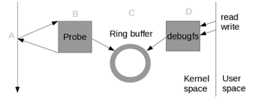

> tcp丢包分析系列文章代码来自谢宝友老师，由西邮陈莉君教授研一学生进行解析，本文由戴君毅整理，梁金荣编辑，贺东升校对。

继续顺下实验代码，前面说过，我们需要为我们（在proc文件系统中）加入的条目编写操作集接口：

```c
const struct file_operations drop_packet_fops = {
	.open           = drop_packet_open,
	.read           = seq_read,
	.llseek         = seq_lseek,
	.write          = drop_packet_write,
	.release        = single_release,
};
```

实验的运行逻辑重点落在了write操作的实现中：

```c
static ssize_t drop_packet_write(struct file *file,
	const char __user *buf, size_t count, loff_t *offs)
{
	int ret;
	char cmd[255];
	char chr[255];

	if (count < 1 || *offs)
		return -EINVAL;

	if (copy_from_user(chr, buf, 255))
		return -EFAULT;

	ret = sscanf(chr, "%255s", cmd);
	if (ret <= 0)
		return -EINVAL;

	if (strcmp(cmd, "activate") == 0) {
		if (!drop_packet_activated)
			drop_packet_activated = activate_drop_packet();
	} else if (strcmp(cmd, "deactivate") == 0) {
		if (drop_packet_activated)
			deactivate_drop_packet();
		drop_packet_activated = 0;
	}

	return count;
}
```

它的逻辑很简单，我们把用户写入的字符串通过`copy_from_user`传入到内核`buf`中，然后调用`sscanf`格式化`buf`为`cmd`，然后跟“activate”和“deactiavate”比较，换句话说，如果用户输入“activate”，那么就可以开启丢包检测了。在加载模块后，用如下命令可以查看proc内容，由`drop_packet_show`实现：

```c
static int drop_packet_show(struct seq_file *m, void *v)
{
	seq_printf(m, "settings:\n");
	seq_printf(m, "  activated: %s\n", drop_packet_activated ? "y" : "N");

	return 0;
}
```

**cat /proc/mooc/net/drop-packet**

结果如下：（省略了settings:）

`activated: N`

执行如下命令，可以激活丢包检测功能：

**echo activate > /proc/mooc/net/drop-packet**

再次查看proc文件内容，结果如下：

`activated: y`

那么接下来自然要看下`activate_drop_packet`干了些什么事：

```c
static int activate_drop_packet(void)
{
	hook_tracepoint("net_dev_xmit", trace_net_dev_xmit_hit, NULL);
	hook_kprobe(&kprobe_dev_queue_xmit, "dev_queue_xmit",
				kprobe_dev_queue_xmit_pre, NULL);
	hook_kprobe(&kprobe_eth_type_trans, "eth_type_trans",
				kprobe_eth_type_trans_pre, NULL);
	hook_kprobe(&kprobe_napi_gro_receive, "napi_gro_receive",
				kprobe_napi_gro_receive_pre, NULL);
	hook_kprobe(&kprobe___netif_receive_skb_core, "__netif_receive_skb_core",
				kprobe___netif_receive_skb_core_pre, NULL);
	hook_kprobe(&kprobe_tcp_v4_rcv, "tcp_v4_rcv",
				kprobe_tcp_v4_rcv_pre, NULL);

	return 1;
}
```

可以看到，这段代码在`net_dev_xmit`中挂接一个`tracepoint`钩子，在`dev_queue_xmit`/`eth_type_trans`/`napi_gro_receive`/`__netif_receive_skb_core`/`tcp_v4_rcv`等函数的入口处挂接一个kprobe钩子。

那么到底什么是tracepoint？kprobe又是什么？说它们之前不得不说一下ftrace。ftrace(function trace)是利用gcc 编译器在编译时在每个函数的入口地址放置一个 probe 点，这个 probe 点会调用一个 probe 函数，这样这个probe 函数会对每个执行的内核函数进行跟踪并打印日志到`ring buffer`中，而用户可以通过 debugfs 来访问`ring buffer`中的内容。



kprobe 是很早前就存在于内核中的一种动态 trace 工具。kprobe 本身利用了 int 3（在 x86 中）实现了 probe 点（对应图中的A）。使用 kprobe 需要用户自己实现 kernel module 来注册 probe 函数。kprobe 并没有统一的B、C 和 D。使用起来用户需要自己实现很多东西，不是很灵活。而在 `function trace` 出现后，kprobe 借用了它的一部分设计模式，实现了统一的 probe 函数（对应于图中的 B），并利用了 `function trace` 的环形缓存和用户接口部分，也就是 C 和 D 部分功能。

而tracepoint是静态的trace，说白了它就是内核开发人员提前设置好的跟踪点，也提供了管理桩函数的接口，它们已经编译进了内核，这样做既有优点也有缺点。优点是使用tracepoint的开销较小，并且它的API相对稳定；缺点也很明显，第一，默认的点明显不够多，可能覆盖不到你的需求；第二，你加一个点就需要重新编译内核，而kprobe不需要；第三，由于是静态的，不使用它也会造成开销（从内核文档可以看出这个问题已经被优化，现在基本忽略）。

实验代码中，挂接kprobe和tracepoint钩子的方法分别为`hook_kprobe`和`hook_tracepoint`，`hook_kprobe`代码如下：

```c
int hook_kprobe(struct kprobe *kp, const char *name,
		kprobe_pre_handler_t pre, kprobe_post_handler_t post)
{
	kprobe_opcode_t *addr;

	if (!name || strlen(name) >= 255)
		return -EINVAL;
	addr = (kprobe_opcode_t *)kallsyms_lookup_name(name);
	if (!addr)
		return -EINVAL;

	memset(kp, 0, sizeof(struct kprobe));
	kp->symbol_name = name;
	kp->pre_handler = pre;
	kp->post_handler = post;

	register_kprobe(kp);

	return 0;
}
```

由于是动态追踪，需要先调用`kallsyms_lookup_name`检查是否有这个函数。如果有这个函数，那么就把kprobe的`pre_handler`和`post_handler`赋值给他，这两个都是钩子，会在其他地方定义好，它才是真正要干的事情，这是kprobe机制规定的，不用觉得奇怪。最后调用`register_kprobe`注册这个kprobe。

`register_kprobe`函数非常复杂，我这里截取最为核心的部分：

```c
cpus_read_lock();
	/* Prevent text modification */
	mutex_lock(&text_mutex);
	ret = prepare_kprobe(p);
	mutex_unlock(&text_mutex);
	cpus_read_unlock();
	if (ret)
		goto out;

	INIT_HLIST_NODE(&p->hlist);
	hlist_add_head_rcu(&p->hlist,
		       &kprobe_table[hash_ptr(p->addr, KPROBE_HASH_BITS)]);

	if (!kprobes_all_disarmed && !kprobe_disabled(p)) {
		ret = arm_kprobe(p);
		if (ret) {
			hlist_del_rcu(&p->hlist);
			synchronize_rcu();
			goto out;
		}
	}
```

`prepare_kprobe`保存当前的指令，`arm_kprobe`将当前指令替换为int3。然后就会执行`kprobe_int3_handler`，此时如果你的handler实现了并且注册了，那么就会执行你的handler了，这里应该就是“插桩”的本质了。

```c
int kprobe_int3_handler(struct pt_regs *regs)
{
	kprobe_opcode_t *addr;
	struct kprobe *p;
	struct kprobe_ctlblk *kcb;

	if (user_mode(regs))
		return 0;

	addr = (kprobe_opcode_t *)(regs->ip - sizeof(kprobe_opcode_t));
	/*
	 * We don't want to be preempted for the entire duration of kprobe
	 * processing. Since int3 and debug trap disables irqs and we clear
	 * IF while singlestepping, it must be no preemptible.
	 */

	kcb = get_kprobe_ctlblk();
	p = get_kprobe(addr);

	if (p) {
		if (kprobe_running()) {
			if (reenter_kprobe(p, regs, kcb))
				return 1;
		} else {
			set_current_kprobe(p, regs, kcb);
			kcb->kprobe_status = KPROBE_HIT_ACTIVE;

			/*
			 * If we have no pre-handler or it returned 0, we
			 * continue with normal processing.  If we have a
			 * pre-handler and it returned non-zero, that means
			 * user handler setup registers to exit to another
			 * instruction, we must skip the single stepping.
			 */
			if (!p->pre_handler || !p->pre_handler(p, regs))
				setup_singlestep(p, regs, kcb, 0);
			else
				reset_current_kprobe();
			return 1;
		}
	} else if (*addr != BREAKPOINT_INSTRUCTION) {...
```

在设置单步调试`setup_singlestep`时，还会把`post_handler`的地址设置为下一个执行指令，以便`pre_handler`返回时可以“reenter”到kprobe异常，顺利执行`post_handler`，最后才执行原本执行的代码，它存放在kprobe结构体中。虽然这个实验并没有实现`post_handler`，但机制就是这样的。

```c
static void setup_singlestep(struct kprobe *p, struct pt_regs *regs,
			     struct kprobe_ctlblk *kcb, int reenter)
{
	if (setup_detour_execution(p, regs, reenter))
		return;

#if !defined(CONFIG_PREEMPT)
	if (p->ainsn.boostable && !p->post_handler) {
		/* Boost up -- we can execute copied instructions directly */
		if (!reenter)
			reset_current_kprobe();
		/*
		 * Reentering boosted probe doesn't reset current_kprobe,
		 * nor set current_kprobe, because it doesn't use single
		 * stepping.
		 */
		regs->ip = (unsigned long)p->ainsn.insn;
		return;
	}
#endif
	if (reenter) {
		save_previous_kprobe(kcb);
		set_current_kprobe(p, regs, kcb);
		kcb->kprobe_status = KPROBE_REENTER;
	} else
		kcb->kprobe_status = KPROBE_HIT_SS;
	/* Prepare real single stepping */
	clear_btf();
	regs->flags |= X86_EFLAGS_TF;
	regs->flags &= ~X86_EFLAGS_IF;
	/* single step inline if the instruction is an int3 */
	if (p->opcode == BREAKPOINT_INSTRUCTION)
		regs->ip = (unsigned long)p->addr;
	else
		regs->ip = (unsigned long)p->ainsn.insn;
}
NOKPROBE_SYMBOL(setup_singlestep);
```

Tracepoint相对简单一点，实验里直接调用了`tracepoint_probe_register`，就不展开说了，通常情况都是用`DECLARE_TRACE` 、` DEFINE_TRACE`这两个宏。可以阅读内核文档查阅一些高级的用法。

值得一提的是，实验代码为tracepoint设置了条件宏以便适应不同的内核版本，比较有意思，这里给出结构大家感受一下：


